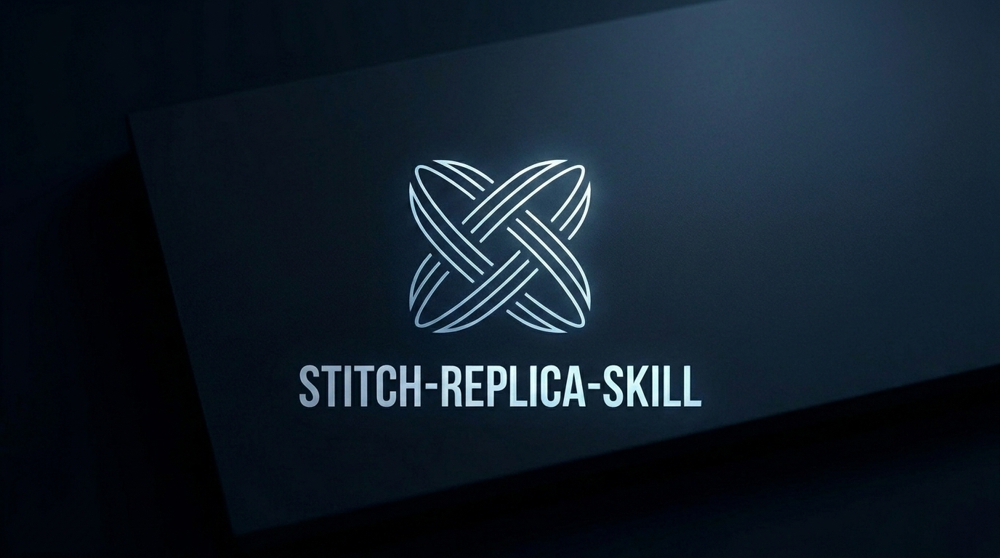
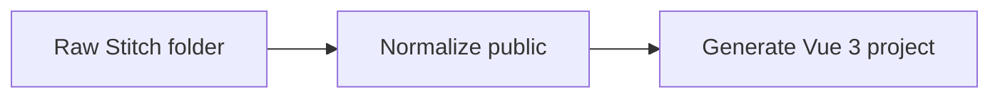

<p align="center">
  
</p>

<h1 align="center">stitch-replica-skill</h1>

<p align="center">
  Turn downloaded Stitch exports into a real Vue 3 + Vite + pnpm project.
</p>

<p align="center">
  <strong>Raw Stitch folder -> normalized public files -> Vue 3 project</strong>
</p>

<p align="center">
  
  
  
  
</p>

## What it does

`stitch-replica-skill` converts Stitch downloads into a Vue 3 project with high-fidelity HTML/CSS/asset preservation. Navigation is normalized for Vue Router, while page bodies are replicated from the source HTML as closely as possible.

Most users only need `stitch-project-generator`. It detects raw `stitch*` exports or normalized `public/` files, prepares the input, and generates a same-name Vue 3 + Vite + pnpm project.

## Install

Install the full skills bundle. Do not install only one skill.

```txt
<your-project>/
  .agents/
    skills/
      stitch-project-generator/
        SKILL.md
      stitch-export-normalizer/
        SKILL.md
      stitch-to-vue-replica/
        SKILL.md
```

Windows PowerShell:

```powershell
cd <your-project>
New-Item -ItemType Directory -Force .agents\skills
Copy-Item -Recurse <path-to-this-repo>\skills\* .agents\skills\
```

macOS / Linux:

```bash
cd <your-project>
mkdir -p .agents/skills
cp -R <path-to-this-repo>/skills/* .agents/skills/
```

Optional, with Node.js / npm:

```bash
npx skills@latest add https://github.com/<your-github-username>/<your-repo-name>
```

If `npx skills` does not install all skills, use the manual copy method above.

## Usage

Put your downloaded Stitch folder in the project root:

```txt
my-project/
  stitch_xxxxxxxxx/
    ...
```

Open Codex from that project root and run:

```txt
$stitch-project-generator 根据当前目录中的 Stitch 下载文件夹生成对应的 Vue3 项目。
```

or simply ask:

```txt
根据 skills 内容，把我下载的 Stitch 文件夹生成对应的 Vue3 项目。
```

Using `$stitch-project-generator` explicitly is recommended. You do not need to manually call the two internal skills. If the same-name Vue project already exists, generation stops and does not overwrite it.

## Generated output

```txt
my-project/
  public/
    DESIGN.md
    <real-page-name>.html

  my-project/
    package.json
    src/
```

Run commands inside the generated inner Vue project, not the outer Stitch source folder.

```bash
cd <project-root>/<project-folder-name>
pnpm install
pnpm dev
```

## How it works



## Advanced

The workflow is split into three skills:

| Skill | Role |
|---|---|
| `stitch-project-generator` | One-stop entry skill for normal users |
| `stitch-export-normalizer` | Internal stage: raw Stitch export -> `public/` |
| `stitch-to-vue-replica` | Internal stage: `public/` -> Vue project |

Most users should only use `stitch-project-generator`.

For maintainers, `skill.sh` can list or install the full skill bundle locally.

## License

MIT
